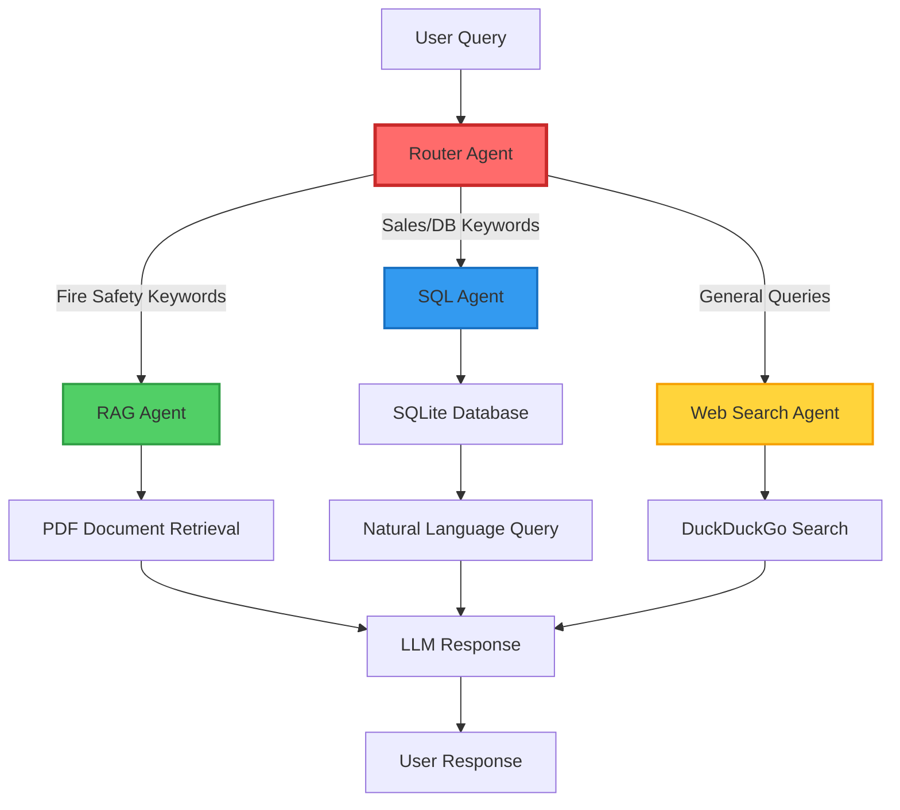

# 🧠 Unified Cognitive Orchestration Engine

[](https://www.python.org/downloads/)
[](https://www.langchain.com/)
[](https://streamlit.io/)
[](LICENSE)

> **An intelligent multi-agent orchestration system powered by LangChain that seamlessly routes queries between specialized AI agents for RAG-based document analysis, SQL database queries, and web search.**

---

## 🎯 Overview

The **Unified Cognitive Orchestration Engine** is a sophisticated AI-powered chatbot that leverages **agentic workflows** to intelligently route user queries to the most appropriate specialized agent. Built with LangChain and Streamlit, this system demonstrates advanced concepts in:

- 🤖 **Multi-Agent Architecture** - Coordinated AI agents working in harmony
- 🧭 **Intelligent Routing** - Smart query classification and delegation
- 📚 **RAG (Retrieval-Augmented Generation)** - Context-aware document Q&A
- 🗄️ **Natural Language to SQL** - Conversational database querying
- 🌐 **Web Search Integration** - Fallback for general knowledge queries
- 🎤 **Voice Input Support** - Whisper-powered speech-to-text

---

## 🏗️ Architecture



### 🔄 Agent Workflow

1. **Router Agent** - Analyzes incoming queries using keyword matching and LLM-based classification
2. **Fire Safety Agent (RAG)** - Retrieves relevant context from PDF documents and generates answers
3. **Sales Data Agent (SQL)** - Converts natural language to SQL queries and executes them
4. **Web Search Agent** - Performs web searches for general knowledge questions

---

## ✨ Key Features

### 🎯 Intelligent Query Routing
- **Keyword-based priority routing** for instant classification
- **LLM-powered fallback** for ambiguous queries
- **Context-aware decision making** with confidence scoring

### 📄 RAG-Powered Document Analysis
- **PDF chunking** with configurable overlap for optimal retrieval
- **Semantic search** across document corpus
- **Context-aware responses** using retrieved information

### 🗃️ Natural Language SQL Queries
- **Zero-shot SQL generation** using LangChain SQL agents
- **Multi-table joins** and complex query support
- **Error handling** with graceful fallbacks

### 🎤 Multimodal Input
- **Text input** via chat interface
- **Voice input** using OpenAI Whisper (base model)
- **Real-time transcription** with visual feedback

### 🖥️ Modern UI/UX
- **Streamlit-powered interface** with responsive design
- **Chat history persistence** across sessions
- **Audio recording** with visual indicators
- **Document upload** for custom RAG contexts

---

## 🛠️ Tech Stack

| Category | Technology |
|----------|-----------|
| **Framework** | LangChain, Streamlit |
| **LLMs** | Ollama (Mistral), Groq (Llama 3 70B) |
| **Database** | SQLite with LangChain SQL Toolkit |
| **Speech-to-Text** | OpenAI Whisper |
| **Web Search** | DuckDuckGo Search API |
| **PDF Processing** | pdfplumber |
| **Environment** | python-dotenv |

---

## 🚀 Quick Start

### Prerequisites

- Python 3.8+
- Ollama installed locally ([Download](https://ollama.ai/))
- Groq API key ([Get one free](https://console.groq.com/))

### Installation

1. **Clone the repository**
```bash
git clone https://github.com/yourusername/unified-cognitive-orchestration-engine.git
cd unified-cognitive-orchestration-engine
```

2. **Install dependencies**
```bash
pip install -r requirements.txt
```

3. **Set up environment variables**
```bash
# Create .env file
cp .env.example .env

# Edit .env and add your API keys
GROQ_API_KEY=your_groq_api_key_here
GEMINI_API_KEY=your_gemini_api_key_here  # Optional
```

4. **Install and start Ollama**
```bash
# Pull the Mistral model
ollama pull mistral
```

5. **Create the sample database**
```bash
python create_database.py
```

6. **Run the application**
```bash
streamlit run app.py
```

The app will open in your browser at `http://localhost:8501`

---

## 📊 Database Schema

The system includes a sample sales database with the following schema:

```sql
regions (region_id, region_name)
products (product_id, product_name, price)
customers (customer_id, customer_name, region_id)
salespersons (salesperson_id, salesperson_name, region_id)
sales (sale_id, region_id, product_id, customer_id, salesperson_id, amount, date)
```

**Example Queries:**
- "What are the total sales in the North region?"
- "Show me all products sold by Eve"
- "Which customer has the highest purchase amount?"

---

## 🎯 Use Cases

### 1️⃣ Enterprise Knowledge Base
Upload company documentation and enable employees to ask questions in natural language.

### 2️⃣ Sales Analytics
Query sales databases conversationally without writing SQL.

### 3️⃣ Customer Support
Combine document search, database queries, and web search for comprehensive support.

### 4️⃣ Research Assistant
Analyze research papers and cross-reference with live web data.

---

## 📁 Project Structure

```
unified-cognitive-orchestration-engine/
│
├── app.py                      # Main Streamlit application
├── sql_agent.py                # SQL agent and Whisper utilities
├── create_database.py          # Database initialization script
├── ChatBot.py                  # Simple chatbot UI (demo)
│
├── .env                        # Environment variables (not in repo)
├── .env.example                # Environment template
├── .gitignore                  # Git ignore rules
├── requirements.txt            # Python dependencies
├── README.md                   # This file
│
├── sales.db                    # SQLite database (auto-generated)
├── documents_FireSafety.pdf    # Sample RAG document
└── uploaded_document.pdf       # User-uploaded documents
```

---

## 🔧 Configuration

### Agent Customization

**Router Agent Keywords** (in `app.py`):
```python
sales_keywords = ["sales", "revenue", "customer", "product", "region", "order", "amount"]
fire_keywords = ["fire", "alarm", "evacuation", "drill", "smoke detector", "extinguisher"]
```

**LLM Settings**:
```python
# Ollama (Local)
llm = Ollama(model="mistral", temperature=0.3)

# Groq (Cloud)
llm = ChatGroq(model_name="llama3-70b-8192", temperature=0)
```

### PDF Chunking
```python
chunk_size = 1000      # Words per chunk
overlap = 200          # Overlapping words between chunks
```

---

## 🧪 Example Interactions

### 🔥 Fire Safety (RAG Agent)
```
User: What are the fire evacuation procedures?
Agent: [Retrieves context from documents_FireSafety.pdf and provides detailed answer]
```

### 📊 Sales Data (SQL Agent)
```
User: Show me all sales by Eve in the North region
Agent: The sales amounts are: 1000.50, 500.00
```

### 🌐 Web Search (Fallback Agent)
```
User: What is the capital of France?
Agent: [Performs DuckDuckGo search and returns answer]
```

### 🎤 Voice Input
```
User: [Clicks microphone and speaks] "What are the total sales?"
Agent: [Transcribes audio using Whisper] → Routes to SQL Agent → Returns answer
```

---

## 🎓 Learning Outcomes

This project demonstrates proficiency in:

- ✅ **LangChain Framework** - Agents, chains, and toolkits
- ✅ **Multi-Agent Systems** - Orchestration and routing patterns
- ✅ **RAG Architecture** - Document retrieval and context injection
- ✅ **Natural Language Processing** - Query understanding and classification
- ✅ **Database Integration** - SQL generation from natural language
- ✅ **Speech Recognition** - Whisper model integration
- ✅ **Web Development** - Streamlit UI/UX design
- ✅ **Software Engineering** - Modular design, error handling, environment management

---

## 🚧 Roadmap

- [ ] Add vector database (Pinecone/Chroma) for semantic search
- [ ] Implement conversation memory across sessions
- [ ] Add support for multiple document formats (DOCX, TXT, HTML)
- [ ] Deploy to cloud (Streamlit Cloud / AWS / GCP)
- [ ] Add user authentication and multi-tenancy
- [ ] Implement agent performance metrics and logging
- [ ] Add support for custom agent plugins
- [ ] Create REST API for programmatic access

---

## 🤝 Contributing

Contributions are welcome! Please feel free to submit a Pull Request.

1. Fork the repository
2. Create your feature branch (`git checkout -b feature/AmazingFeature`)
3. Commit your changes (`git commit -m 'Add some AmazingFeature'`)
4. Push to the branch (`git push origin feature/AmazingFeature`)
5. Open a Pull Request

---

## 📄 License

This project is licensed under the MIT License - see the [LICENSE](LICENSE) file for details.

---

## 👨‍💻 Author

**Devdutt S**

---

## 🙏 Acknowledgments

- [LangChain](https://www.langchain.com/) for the amazing agent framework
- [Streamlit](https://streamlit.io/) for the intuitive UI framework
- [Groq](https://groq.com/) for lightning-fast LLM inference
- [Ollama](https://ollama.ai/) for local LLM deployment
- [OpenAI Whisper](https://github.com/openai/whisper) for speech recognition

---

<div align="center">

**⭐ Star this repo if you find it useful!**

Made with ❤️ and 🤖 by Devdutt S

</div>
